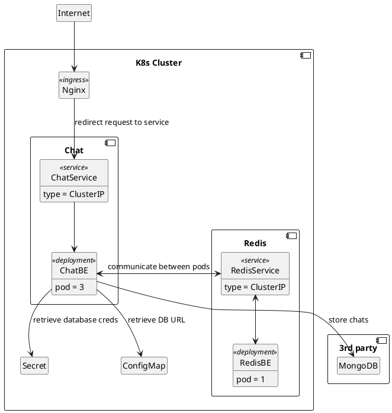

```plantuml

@startuml

' skinparam linetype ortho
skinparam shadowing false
hide empty fields
hide empty methods
hide circle

class Internet

component "K8s Cluster" {
    class Secret
    class ConfigMap
    class Nginx <<ingress>>

    component Redis {
        class RedisService <<service>> {
            type = ClusterIP
        }
        class RedisBE <<deployment>> {
            pod = 1
        }

        RedisService <--> RedisBE
    }

    component Chat {
        class ChatService <<service>> {
            type = ClusterIP
        }
        class ChatBE <<deployment>> {
            pod = 3
        }

        ChatService --> ChatBE
    }

    ChatBE --> ConfigMap: retrieve DB URL
    RedisService <-> ChatBE: communicate between pods
    ChatBE --> Secret: retrieve database creds

    Internet --> Nginx
    Nginx --> ChatService: redirect request to service
}

component "3rd party" {
    class MongoDB {}
    ChatBE --> MongoDB: store chats
}

@enduml

```
