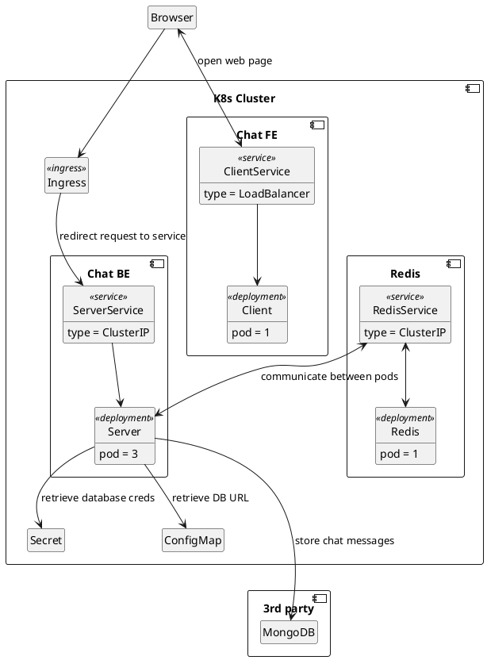

```plantuml

@startuml

skinparam shadowing false
hide empty fields
hide empty methods
hide circle

class Browser

component "K8s Cluster" {
    class Secret
    class ConfigMap
    class Ingress <<ingress>>

    component Redis {
        class RedisService <<service>> {
            type = ClusterIP
        }
        class Redis <<deployment>> {
            pod = 1
        }

        RedisService <--> Redis
    }

    component "Chat BE" {
        class ServerService <<service>> {
            type = ClusterIP
        }
        class Server <<deployment>> {
            pod = 3
        }

        ServerService --> Server
    }

    component "Chat FE" {
        class Client <<deployment>> {
            pod = 1
        }

        class ClientService <<service>> {
            type = LoadBalancer
        }

        ClientService --> Client
    }

    Server --> ConfigMap: retrieve DB URL
    RedisService <--> Server: communicate between pods
    Server --> Secret: retrieve database creds

    ClientService <--> Browser: open web page
    Browser --> Ingress
    Ingress --> ServerService: redirect request to service
}

component "3rd party" {
    class MongoDB {}
    Server ---> MongoDB: store chat messages
}

@enduml

```
